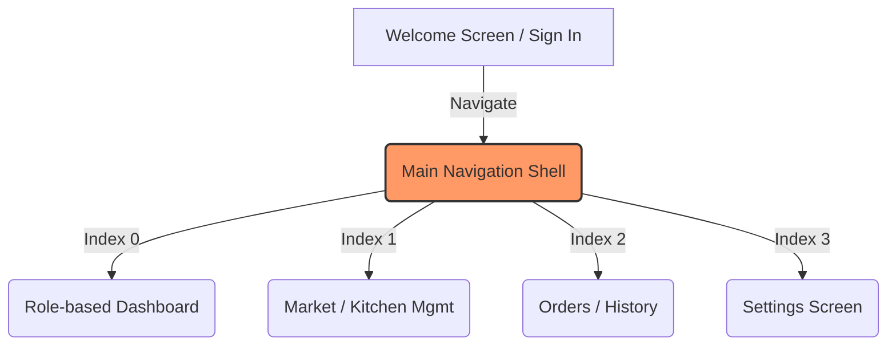

# Project Optimization & Bug Fix Walkthrough

This document outlines the environment configuration setup, navigation architecture refactoring, visual polish, and stability bug fixes implemented in the **Plokitch** Flutter application.

---

## 🛠️ Summary of Changes

### 1. Environment Configuration Setup
* **Action**: Extracted and created the missing `.env` file at the root of the project.
* **Details**: Restored credentials and endpoint configurations matching commit `a09e5b8`, resolving the compile-time asset error (`No file or variants found for asset: .env.`).

### 2. Navigation & Performance Optimizations
* **Action**: Introduced a unified `MainNavigationShell` to resolve screen flashing.
* **Details**: 
  * Replaced individual screen `bottomNavigationBar` configurations with a parent wrapper.
  * Replaced `IndexedStack` with a custom `FadeIndexedStack` that animates transitions.
  * **Snappy Tab Switching Animation**: Implemented a smooth 180ms cross-fade animation between tabs while preserving the states/caches of all active screens (so data does not reload when switching).
  * Removed `Navigator.pushReplacementNamed` page transitions for tab switching, allowing tabs to change instantaneously with zero rebuild-induced screen flashing.
  * Disallowed screen overlap by disabling Scaffold's `extendBody` property, which resolves nested Scaffold constraints.

### 3. Visual & UI Polish
* **Action**: Enhanced `PlokitchBottomNav` styling.
* **Details**:
  * **Floating Style**: Converted the bottom bar into a premium floating capsule with a rounded border (`BorderRadius.circular(28)`), bottom/side margins, and a soft drop shadow.
  * **Active Tab Indicator**: Removed the solid background capsule fill and replaced it with a stroke-less aesthetic. Active states are indicated via:
    1. Primary brand color (orange) icon and text.
    2. Bold label weights.
    3. Dynamic icon swapping (outlined icons swap to filled icons, e.g., `Icons.home_outlined` ➔ `Icons.home` when active).
  * **Haptic Feedback**: Added native haptic feedback (`HapticFeedback.selectionClick()`) when tapping any tab to provide a responsive and tactile feel on mobile/tablet devices.

### 4. Direct Profile Picture Device Uploads
* **Action**: Enabled uploading avatar images directly from devices in [account_details_screen.dart](file:///home/adam/Projects/plokitch-app/lib/screens/account_details_screen.dart).
* **Details**:
  * **File Picker Integration**: Added the `file_picker` dependency to allow selecting images directly from the local device storage on both mobile/tablet and web platforms.
  * **Size Cap Limit (2MB)**: Integrated an size validation check that rejects any chosen image file larger than 2MB with a user-friendly error message.
  * **Supabase Storage upload**: Automatically uploads selected files to the public `avatars` bucket in Supabase Storage and fetches the public image URL, displaying it immediately as a preview on the profile.
  * **Loading Indicator**: Renders a loading spinner inside the avatar placeholder while the upload is in progress.
  * **Preserved URL Input**: Kept the existing "Enter Image URL" option as a secondary choice in a new bottom sheet options menu.

### 5. Responsiveness & Bug Fixes
* **Action**: Fixed runtime assertion failures and layout overflows.
* **Details**:
  * **Settings Screen Crash**: Fixed the `!(shape != null && borderRadius != null)` assertion error on the Appearance section in [settings_screen.dart](file:///home/adam/Projects/plokitch-app/lib/screens/settings_screen.dart). Removed the duplicate `borderRadius` parameter from the `Material` wrapper to allow the circular `shape` configuration to govern the border clipping.
  * **Raw JSON Rendering on Orders Screen**: Corrected the string parser helper `_extractString` in [order_model.dart](file:///home/adam/Projects/plokitch-app/lib/models/order_model.dart) to extract the `'businessName'` and `'business_name'` keys from vendor JSON maps (instead of printing the raw serialized map object on the screen).
  * **Horizontal Overflow**: Wrapped the vendor name text inside [order_history_screen.dart](file:///home/adam/Projects/plokitch-app/lib/screens/order_history_screen.dart) with an `Expanded` widget and `TextOverflow.ellipsis`, ensuring the UI behaves responsively on tablets and wider displays without breaking the layout.

### 6. Branded Success Dialogs & FilePicker API Upgrade
* **Action**: Fixed static analysis compiler error and customized save/upload success alerts in [account_details_screen.dart](file:///home/adam/Projects/plokitch-app/lib/screens/account_details_screen.dart).
* **Details**:
  * **FilePicker API Update**: Migrated the library call from `FilePicker.platform.pickFiles` to the static `FilePicker.pickFiles` method to support the `file_picker` version `11.0.2` API changes, resolving the `'platform' isn't defined` compiler error.
  * **Background Blur Popups**: Replaced standard black `SnackBar` success alerts with a custom, branded dialog widget (`_showSuccessDialog`).
  * **Brand Aesthetics**: The popup dialog utilizes `BackdropFilter` (blur sigma: 5.0) to blur the background screen elements, displays a styled primary-color check icon, renders headings in `Lilita One`, bodies in `Plus Jakarta Sans`, and includes a custom primary action button matching the app's brand theme.

### 7. Profile Avatar Database Sync & Instant UI Updates
* **Action**: Resolved database field mismatch bugs and improved settings navigation to enable live profile avatar changes.
* **Details**:
  * **Database Column Alignment**: Fixed a field mismatch where the app was updating the user profile with the key `'avatarUrl'` but the backend expected the key `'image'`. The payload was updated to write to `'image'`, which successfully updates the Supabase database.
  * **API Response Mapping**: Enhanced `AccountDetailsScreen`, `SettingsScreen`, and `ChefDashboardScreen` to look for the `'image'` key in the user profile payload first, before falling back to `'avatarUrl'` or `'avatar_url'`.
  * **Reactive Settings Refresh**: Changed the navigation transitions from `SettingsScreen` to `AccountDetailsScreen` to `await` the navigation pop. When returning from the edit profile page, the settings page automatically calls `_loadProfile()` to instantly reflect the new profile name, email, and avatar picture on the UI without requiring an app reload.

### 8. Custom Notification Settings, Clean Navigation & Glassmorphic Blur
* **Action**: Implemented Notification settings, cleaned up redundant settings items, and added a premium blurred glass header card.
* **Details**:
  * **Notification Settings Screen**: Created a brand-matching [notification_settings_screen.dart](file:///home/adam/Projects/plokitch-app/lib/screens/notification_settings_screen.dart) featuring toggles for Push Alerts and Marketing Emails, integrated with local SharedPreferences caching and backend API sync.
  * **Redundant Order History Removed**: Removed the 'Order History' settings item from the Preferences list to keep the profile page clean, as orders are already managed by the dedicated bottom navigation tab.
  * **Glassmorphic Header Blur**: Styled the profile details anchor card with frosted glass aesthetics utilizing `ClipRRect` and `BackdropFilter` (blur sigma: 10). Replaced the solid thick background with a semitransparent primary theme overlay (`primary.withValues(alpha: 0.12)`) and a delicate primary border.

### 9. Marketplace Header Removed, Rounded Capsule Shapes & Theme Color Sync
* **Action**: Hidden redundant back buttons, removed the giant Marketplace header, applied capsule border radii, and synchronized color theme.
* **Details**:
  * **Removed Implied Back Buttons**: Added an `automaticallyImplyLeading` parameter to [plokitch_app_bar.dart](file:///home/adam/Projects/plokitch-app/lib/widgets/plokitch_app_bar.dart) and set it to `false` for [settings_screen.dart](file:///home/adam/Projects/plokitch-app/lib/screens/settings_screen.dart) and [order_history_screen.dart](file:///home/adam/Projects/plokitch-app/lib/screens/order_history_screen.dart).
  * **Removed Marketplace Text**: Removed the `SliverAppBar` from [market_screen.dart](file:///home/adam/Projects/plokitch-app/lib/screens/market_screen.dart) to hide the giant "Marketplace" (or "Kitchen") text header, wrapping the `CustomScrollView` in a `SafeArea` for layout stability.
  * **Capsule Rounded Search & Cart**: Redesigned the search and cart area. The search bar is placed in an inline `Row` with the cart button (which sits in a 56x56 container). Both have been styled with fully circular capsule rounded corners (`BorderRadius.circular(28)`).
  * **Theme Color Sync**: Added `surfaceContainer` and `surfaceContainerHigh` keys to the `lightTheme` configuration inside [plokitch_theme.dart](file:///home/adam/Projects/plokitch-app/lib/theme/plokitch_theme.dart). This ensures that the search bar and cart button backgrounds correctly use the warm cream container color rather than rendering transparently.

### 10. Custom Animated Top-Toast, Branded Logout Warn & Market/Detail UI Polish
* **Action**: Created a reusable animated notification, added a logout warning, and polished button/card themes.
* **Details**:
  * **Custom PlokitchToast Notification**: Built [plokitch_toast.dart](file:///home/adam/Projects/plokitch-app/lib/widgets/plokitch_toast.dart) — an Overlay-based custom notification that slides down from the top of the screen using an elastic curve (`Curves.easeOutBack`) and matches the brand's styling and shapes. We integrated it in [food_detail_screen.dart](file:///home/adam/Projects/plokitch-app/lib/screens/food_detail_screen.dart) to replace all generic bottom SnackBars.
  * **Branded Logout Confirmation Dialog**: Added a custom confirmation pop-up using `BackdropFilter` and error-tinted badge warnings in [settings_screen.dart](file:///home/adam/Projects/plokitch-app/lib/screens/settings_screen.dart#L53) to ask users to verify before logging out.
  * **Polished Add to Cart Button**: Styled the "Add to Cart" button in [food_detail_screen.dart](file:///home/adam/Projects/plokitch-app/lib/screens/food_detail_screen.dart#L121) using the brand's solid `primaryContainer` (orange) and `onPrimaryContainer` (dark brown) colors for clean visibility in Light mode.
  * **Outlined Dish Grid Cards**: Added a thin outline (`Border.all(color: colorScheme.outlineVariant.withValues(alpha: 0.4))`) and clean shadow to the popular dishes cards in [market_screen.dart](file:///home/adam/Projects/plokitch-app/lib/screens/market_screen.dart#L320) to make them stand out elegantly.
  * **Dynamic Dark/Light Search Inputs**: Handled dark mode backgrounds for search and cart containers, shifting from the brand's warm cream to a matching charcoal gray (`colorScheme.surfaceContainerHigh`) on dark themes.
  * **Faded Circular Back Buttons**: Styled the leading back button in [plokitch_app_bar.dart](file:///home/adam/Projects/plokitch-app/lib/widgets/plokitch_app_bar.dart#L43) with a custom circular container utilizing a faded primary tint (`colorScheme.primary.withValues(alpha: 0.08)`).
  * **Reactive Marketplace Cart Badge**: Integrated a badge counter overlay on the inline Marketplace cart icon. It reads item quantities using `CartService.loadCart()` and automatically updates whenever the user returns from the Cart or Food Detail screens.
  * **Centered Cart Icon & Badge**: Fixed alignment issues where the default padding of `IconButton` pushed the cart icon off-center and clipped the badge. Replaced the `IconButton` with a centered `GestureDetector` wrapping a direct `Badge` + `Icon` layout for pixel-perfect centering inside the circular button.
  * **Hidden Bottom Navigation in Notifications**: Removed the `bottomNavigationBar` component entirely from [notifications_screen.dart](file:///home/adam/Projects/plokitch-app/lib/screens/notifications_screen.dart#L209) so that it is properly hidden when viewing notifications.
  * **Interactive Live Notification Badge**: Converted [plokitch_app_bar.dart](file:///home/adam/Projects/plokitch-app/lib/widgets/plokitch_app_bar.dart) to a `StatefulWidget` which automatically loads and displays the unread notification count as a beautiful overlay `Badge`. Added/synchronized the notification icon across settings, orders, chef dashboard, and rider dashboard app bars.
  * **Login Notification Hook**: Created the `addNotification` method in [api_service.dart](file:///home/adam/Projects/plokitch-app/lib/services/api_service.dart#L154) and integrated it inside [sign_in_screen.dart](file:///home/adam/Projects/plokitch-app/lib/screens/sign_in_screen.dart#L30) to generate a "Login Alert" notification whenever a user successfully logs in.
  * **Login Notification Preference Toggle**: Added a "Login Alerts" preference switch to [notification_settings_screen.dart](file:///home/adam/Projects/plokitch-app/lib/screens/notification_settings_screen.dart#L145) to toggle login notifications. If toggled off, login alert history updates and the top-sliding pop-up toast are skipped entirely.
  * **Direct Notification Table Integration**: Switched notification fetching (`GET /api/notifications`), marking read (`PATCH /api/notifications/:id/read`), and marking all read (`POST /api/notifications/read-all`) to communicate directly with the dedicated Fastify endpoints in [api_service.dart](file:///home/adam/Projects/plokitch-app/lib/services/api_service.dart#L172-L198) and [notifications_screen.dart](file:///home/adam/Projects/plokitch-app/lib/screens/notifications_screen.dart#L50). This resolves the issue where notifications were not shown on the list or on the app bar icon since the `/api/users/me` endpoint does not store or return relation table data.
  * **Database Notification Creation**: Updated `ApiService.addNotification` to send a POST request to `/api/notifications` in [api_service.dart](file:///home/adam/Projects/plokitch-app/lib/services/api_service.dart#L154-L170), persisting login notifications directly in the PostgreSQL database.
  * **Time formatting utility**: Added a relative helper method `_formatTime` inside [notifications_screen.dart](file:///home/adam/Projects/plokitch-app/lib/screens/notifications_screen.dart#L74) to format `createdAt` ISO timestamps returned by the database.

---

## 📂 Modified Files

* [**.env**](file:///home/adam/Projects/plokitch-app/.env)
* [**pubspec.yaml**](file:///home/adam/Projects/plokitch-app/pubspec.yaml)
* [**walkthrough.md**](file:///home/adam/Projects/plokitch-app/walkthrough.md)
* [**lib/main.dart**](file:///home/adam/Projects/plokitch-app/lib/main.dart)
* [**lib/theme/plokitch_theme.dart**](file:///home/adam/Projects/plokitch-app/lib/theme/plokitch_theme.dart)
* [**lib/services/api_service.dart**](file:///home/adam/Projects/plokitch-app/lib/services/api_service.dart)
* [**lib/screens/main_navigation_shell.dart**](file:///home/adam/Projects/plokitch-app/lib/screens/main_navigation_shell.dart)
* [**lib/widgets/plokitch_bottom_nav.dart**](file:///home/adam/Projects/plokitch-app/lib/widgets/plokitch_bottom_nav.dart)
* [**lib/models/order_model.dart**](file:///home/adam/Projects/plokitch-app/lib/models/order_model.dart)
* [**lib/screens/sign_in_screen.dart**](file:///home/adam/Projects/plokitch-app/lib/screens/sign_in_screen.dart)
* [**lib/screens/order_history_screen.dart**](file:///home/adam/Projects/plokitch-app/lib/screens/order_history_screen.dart)
* [**lib/screens/settings_screen.dart**](file:///home/adam/Projects/plokitch-app/lib/screens/settings_screen.dart)
* [**lib/screens/account_details_screen.dart**](file:///home/adam/Projects/plokitch-app/lib/screens/account_details_screen.dart)
* [**lib/screens/kitchen_management_screen.dart**](file:///home/adam/Projects/plokitch-app/lib/screens/kitchen_management_screen.dart)
* [**lib/screens/chef_dashboard_screen.dart**](file:///home/adam/Projects/plokitch-app/lib/screens/chef_dashboard_screen.dart)
* [**lib/screens/chef_orders_screen.dart**](file:///home/adam/Projects/plokitch-app/lib/screens/chef_orders_screen.dart)
* [**lib/screens/rider_dashboard_screen.dart**](file:///home/adam/Projects/plokitch-app/lib/screens/rider_dashboard_screen.dart)
* [**lib/screens/market_screen.dart**](file:///home/adam/Projects/plokitch-app/lib/screens/market_screen.dart)
* [**lib/screens/map_explorer_screen.dart**](file:///home/adam/Projects/plokitch-app/lib/screens/map_explorer_screen.dart)
* [**lib/screens/notification_settings_screen.dart**](file:///home/adam/Projects/plokitch-app/lib/screens/notification_settings_screen.dart)
* [**lib/screens/notifications_screen.dart**](file:///home/adam/Projects/plokitch-app/lib/screens/notifications_screen.dart)
* [**lib/screens/food_detail_screen.dart**](file:///home/adam/Projects/plokitch-app/lib/screens/food_detail_screen.dart)
* [**lib/widgets/plokitch_app_bar.dart**](file:///home/adam/Projects/plokitch-app/lib/widgets/plokitch_app_bar.dart)
* [**lib/widgets/plokitch_toast.dart**](file:///home/adam/Projects/plokitch-app/lib/widgets/plokitch_toast.dart)

---

> [!TIP]
> Ensure you trigger a **Hot Restart** (`R` in the Flutter run console) to instantiate the new `MainNavigationShell` and refresh active route navigation parameters!
