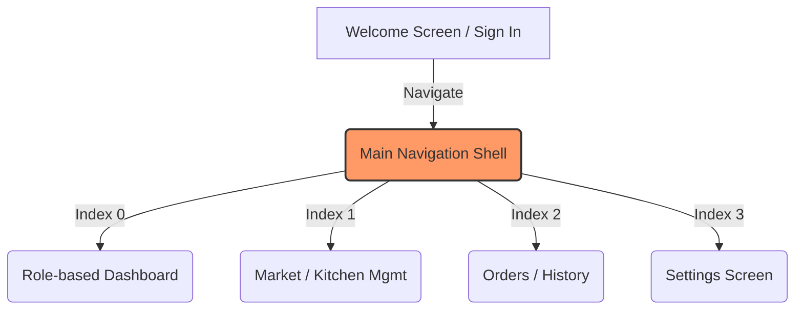

# Project Optimization & Bug Fix Walkthrough

This document outlines the environment configuration setup, navigation architecture refactoring, visual polish, and stability bug fixes implemented in the **Plokitch** Flutter application.

---

## 🛠️ Summary of Changes

### 1. Environment Configuration Setup
* **Action**: Extracted and created the missing `.env` file at the root of the project.
* **Details**: Restored credentials and endpoint configurations matching commit `a09e5b8`, resolving the compile-time asset error (`No file or variants found for asset: .env.`).

### 2. Navigation & Performance Optimizations
* **Action**: Introduced a unified `MainNavigationShell` to resolve screen flashing.
* **Details**: 
  * Replaced individual screen `bottomNavigationBar` configurations with a parent wrapper.
  * Replaced `IndexedStack` with a custom `FadeIndexedStack` that animates transitions.
  * **Snappy Tab Switching Animation**: Implemented a smooth 180ms cross-fade animation between tabs while preserving the states/caches of all active screens (so data does not reload when switching).
  * Removed `Navigator.pushReplacementNamed` page transitions for tab switching, allowing tabs to change instantaneously with zero rebuild-induced screen flashing.
  * Disallowed screen overlap by disabling Scaffold's `extendBody` property, which resolves nested Scaffold constraints.

### 3. Visual & UI Polish
* **Action**: Enhanced `PlokitchBottomNav` styling.
* **Details**:
  * **Floating Style**: Converted the bottom bar into a premium floating capsule with a rounded border (`BorderRadius.circular(28)`), bottom/side margins, and a soft drop shadow.
  * **Active Tab Indicator**: Removed the solid background capsule fill and replaced it with a stroke-less aesthetic. Active states are indicated via:
    1. Primary brand color (orange) icon and text.
    2. Bold label weights.
    3. Dynamic icon swapping (outlined icons swap to filled icons, e.g., `Icons.home_outlined` ➔ `Icons.home` when active).
  * **Haptic Feedback**: Added native haptic feedback (`HapticFeedback.selectionClick()`) when tapping any tab to provide a responsive and tactile feel on mobile/tablet devices.

### 4. Direct Profile Picture Device Uploads
* **Action**: Enabled uploading avatar images directly from devices in [account_details_screen.dart](file:///home/adam/Projects/plokitch-app/lib/screens/account_details_screen.dart).
* **Details**:
  * **File Picker Integration**: Added the `file_picker` dependency to allow selecting images directly from the local device storage on both mobile/tablet and web platforms.
  * **Size Cap Limit (2MB)**: Integrated an size validation check that rejects any chosen image file larger than 2MB with a user-friendly error message.
  * **Supabase Storage upload**: Automatically uploads selected files to the public `avatars` bucket in Supabase Storage and fetches the public image URL, displaying it immediately as a preview on the profile.
  * **Loading Indicator**: Renders a loading spinner inside the avatar placeholder while the upload is in progress.
  * **Preserved URL Input**: Kept the existing "Enter Image URL" option as a secondary choice in a new bottom sheet options menu.

### 5. Responsiveness & Bug Fixes
* **Action**: Fixed runtime assertion failures and layout overflows.
* **Details**:
  * **Settings Screen Crash**: Fixed the `!(shape != null && borderRadius != null)` assertion error on the Appearance section in [settings_screen.dart](file:///home/adam/Projects/plokitch-app/lib/screens/settings_screen.dart). Removed the duplicate `borderRadius` parameter from the `Material` wrapper to allow the circular `shape` configuration to govern the border clipping.
  * **Raw JSON Rendering on Orders Screen**: Corrected the string parser helper `_extractString` in [order_model.dart](file:///home/adam/Projects/plokitch-app/lib/models/order_model.dart) to extract the `'businessName'` and `'business_name'` keys from vendor JSON maps (instead of printing the raw serialized map object on the screen).
  * **Horizontal Overflow**: Wrapped the vendor name text inside [order_history_screen.dart](file:///home/adam/Projects/plokitch-app/lib/screens/order_history_screen.dart) with an `Expanded` widget and `TextOverflow.ellipsis`, ensuring the UI behaves responsively on tablets and wider displays without breaking the layout.

---

## 📂 Modified Files

* [**.env**](file:///home/adam/Projects/plokitch-app/.env)
* [**pubspec.yaml**](file:///home/adam/Projects/plokitch-app/pubspec.yaml)
* [**walkthrough.md**](file:///home/adam/Projects/plokitch-app/walkthrough.md)
* [**lib/main.dart**](file:///home/adam/Projects/plokitch-app/lib/main.dart)
* [**lib/screens/main_navigation_shell.dart**](file:///home/adam/Projects/plokitch-app/lib/screens/main_navigation_shell.dart)
* [**lib/widgets/plokitch_bottom_nav.dart**](file:///home/adam/Projects/plokitch-app/lib/widgets/plokitch_bottom_nav.dart)
* [**lib/models/order_model.dart**](file:///home/adam/Projects/plokitch-app/lib/models/order_model.dart)
* [**lib/screens/order_history_screen.dart**](file:///home/adam/Projects/plokitch-app/lib/screens/order_history_screen.dart)
* [**lib/screens/settings_screen.dart**](file:///home/adam/Projects/plokitch-app/lib/screens/settings_screen.dart)
* [**lib/screens/account_details_screen.dart**](file:///home/adam/Projects/plokitch-app/lib/screens/account_details_screen.dart)
* [**lib/screens/kitchen_management_screen.dart**](file:///home/adam/Projects/plokitch-app/lib/screens/kitchen_management_screen.dart)
* [**lib/screens/chef_dashboard_screen.dart**](file:///home/adam/Projects/plokitch-app/lib/screens/chef_dashboard_screen.dart)
* [**lib/screens/chef_orders_screen.dart**](file:///home/adam/Projects/plokitch-app/lib/screens/chef_orders_screen.dart)
* [**lib/screens/rider_dashboard_screen.dart**](file:///home/adam/Projects/plokitch-app/lib/screens/rider_dashboard_screen.dart)
* [**lib/screens/market_screen.dart**](file:///home/adam/Projects/plokitch-app/lib/screens/market_screen.dart)
* [**lib/screens/map_explorer_screen.dart**](file:///home/adam/Projects/plokitch-app/lib/screens/map_explorer_screen.dart)

---

> [!TIP]
> Ensure you trigger a **Hot Restart** (`R` in the Flutter run console) to instantiate the new `MainNavigationShell` and refresh active route navigation parameters!
